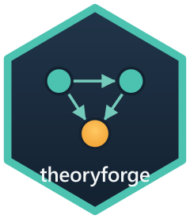

# theoryforge (Python) 

<!-- badges: start -->
[](https://github.com/pablobernabeu/theoryforge/actions/workflows/ci.yml)
[](https://pablobernabeu.github.io/theoryforge/python/)
[](https://pypi.org/project/theoryforge/)
[](https://pypi.org/project/theoryforge/)
[](https://opensource.org/license/MIT)
[](https://doi.org/10.5281/zenodo.21229964)
<!-- badges: end -->

Systematic theory development: a rigorous, reproducible workflow for building, developing and
testing scientific theories. This is the feature-parity twin of
[the R package](https://pablobernabeu.github.io/theoryforge/r/) of the same name, which offers
the same workflow in R. The two produce identical verdicts and byte-identical diagram
intermediate representations.

The rendered documentation site, with the API reference and worked guides, is at
<https://pablobernabeu.github.io/theoryforge/python/>.

The [interactive web app](https://pablobernabeu.github.io/theoryforge/apps/py/) runs this
package in your browser via [Pyodide](https://pyodide.org/), with nothing to install. You can
load a theory and run any operation there, then export the visualisation (SVG/PNG) together
with the Python code that reproduces it.

## Installation

The package is on [PyPI](https://pypi.org/project/theoryforge/):

```bash
pip install theoryforge
```

The optional render extra adds native diagram rendering (`render_diagram()`,
which wraps the DOT views in a `graphviz.Source`):

```bash
pip install "theoryforge[render]"
```

The development version installs from the `python/` subdirectory of the repository:

```bash
pip install "git+https://github.com/pablobernabeu/theoryforge.git#subdirectory=python"
```

To work on the package itself, install an editable checkout with the development extras, from
the `python/` directory of a clone:

```bash
pip install -e ".[dev]"
```

## Quick start

The example theories live in `fixtures/` at the root of the repository, so run
the lines below from a clone, with `python/` as the working directory.

```python
import theoryforge as tf

# read + check an existing theory
t = tf.read("../fixtures/panic-network.theory.yaml")
t.validate()                       # structural validation against the shared schema
print(t.report("json"))            # 12-item rigour checklist + gate
print(t.diagram("nomological_net"))# Graphviz DOT
# t.render_diagram("nomological_net")  # rendered inline; needs theoryforge[render]
t.redundancy_check()               # lexical jingle-jangle screen

# BUILD a theory programmatically (provenance auto-logged)
b = (tf.new_theory("panic_demo", "A demonstration theory of panic")
       .add_construct("arousal", "Physiological arousal", "bodily signs of sympathetic activation",
                      measurement=["heart_rate", "skin_conductance"], boundary_conditions=["adults"])
       .add_construct("catastrophic_interpretation", "Catastrophic interpretation",
                      "appraisal of bodily sensations as dangerous", measurement=["bsiq"])
       .add_proposition("p1", "arousal", "catastrophic_interpretation", "increases",
                        mechanism="rising arousal is read as evidence of threat")
       .add_prediction("pred1", "higher arousal predicts more catastrophic interpretation",
                       "directional", derives_from=["p1"]))
b.validate(full=True)              # ids are unique and every cross-reference resolves

# DEVELOP: progressive vs degenerating appraisal of an amendment
v1 = tf.read("../fixtures/panic-network.theory.yaml")
v2 = tf.read("../fixtures/panic-network-2026-v2.theory.yaml")
print(v2.appraise_amendment(v1))   # -> {'verdict': 'progressive', ...}

# TEST: operationalised severity + a preregistration document
t.severity()                       # per-prediction risk + computed severity
print(t.preregister())             # markdown prereg

# LITERATURE: map the field, then position the theory against it
corpus = tf.read_corpus("../fixtures/panic-corpus.yaml")
tf.litmap(corpus)                  # keyword co-occurrence, themes, co-citation
t.landscape(corpus)                # -> themes flagged 'under_theorised' / 'crowded' (redundancy risk)
# tf.fetch_corpus("panic disorder theory")  # optional OpenAlex fetch (network call)
```

The `../fixtures/*.yaml` files referenced above are sample theories that live in the
[project repository](https://github.com/pablobernabeu/theoryforge). Adjust the paths to
your own theory files when running the examples.

## Test

The suite is offline and runs from the same directory as the editable install:

```bash
pytest
```

## What the package provides

The deterministic core covers theory-object I/O and validation, the 12-item rigour checklist
with its weighted aggregate score and blocker gate, ten diagram exporters and a lexical
redundancy screen. The three workflow modes sit on the same object. BUILDING is a builder API
that logs its own provenance, DEVELOPMENT is the Lakatosian appraisal of an amendment, and
TESTING is the operationalised severity rubric with its preregistration export.

The literature layer starts from `read_corpus`. `litmap` derives keyword co-occurrence,
deterministic connected-component themes and co-citation, and `landscape` maps a theory and its
alternatives onto those themes, flagging under-theorised fronts and redundancy risk.
`lit_diagram` draws the co-occurrence, co-citation and theme-landscape views. Where a network
connection is available, the `fetch_corpus` OpenAlex adapter retrieves a corpus, and
`new_evidence_dois` checks deterministically which candidate DOIs, from any search tool, a
theory does not yet cite.

Beyond the modes, `compile_sem` translates constructs and propositions to lavaan model syntax,
and `dossier` assembles a reviewer-facing audit bundle. Simulation and the outward-facing
adapters round the package out. `simulate` runs the construct network as a deterministic
dynamical system, `render_report` wraps the dossier in a Quarto report, `embedding_redundancy`
adds an opt-in, embedder-dependent screen, and `osf_push` deposits to OSF, dry-run by default.

## Citation

Please cite theoryforge if it contributes to work you publish. The
[About page](https://pablobernabeu.github.io/theoryforge/python/about/) carries the citation
with a BibTeX entry, and a short note on the developer. The repository also ships
`CITATION.cff`, which drives GitHub's "Cite this repository" button.

## Licence

MIT. See [LICENSE](LICENSE).

## Contributing

Issues and pull requests are welcome. The [contributing
guide](https://github.com/pablobernabeu/theoryforge/blob/main/.github/CONTRIBUTING.md)
describes the development setup and the conventions the package follows, and everyone taking
part is asked to honour the [Code of
Conduct](https://github.com/pablobernabeu/theoryforge/blob/main/.github/CODE_OF_CONDUCT.md).

Continuous integration lints, type-checks and tests the package on every push, and the
cross-language parity check compares its output against the R twin on every fixture, so a
change that breaks parity is caught before it lands.
