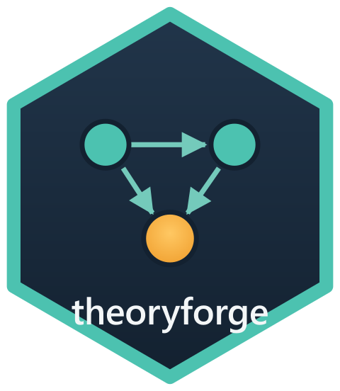

# theoryforge (R) <a href="https://pablobernabeu.github.io/theoryforge/r/"></a>

<!-- badges: start -->
[](https://github.com/pablobernabeu/theoryforge/actions/workflows/ci.yml)
[](https://lifecycle.r-lib.org/articles/stages.html#experimental)
[](https://opensource.org/license/MIT)
<!-- badges: end -->

Systematic theory development: a rigorous, reproducible workflow for building, developing and
testing scientific theories. This is the feature-parity twin of [the Python package](https://pablobernabeu.github.io/theoryforge/python/) of the same
name. Behaviour is pinned by the shared specification
([`API_SPEC.md`](https://github.com/pablobernabeu/theoryforge/blob/main/API_SPEC.md)) so the two
implementations produce identical verdicts and byte-identical diagram intermediate
representations.

## Interactive web app

Run the package in your browser, with no installation, using the
[interactive web app](https://pablobernabeu.github.io/theoryforge/apps/r/). It executes the real
package client-side via [webR](https://docs.r-wasm.org/webr/latest/): load a theory, run any
operation, and export both the visualisation (SVG/PNG) and the R code to reproduce it.

## Installation

```r
remotes::install_github("pablobernabeu/theoryforge", subdir = "r/theoryforge")
```

From a local checkout, the package also installs as source:

```r
# from the repository root
install.packages("r/theoryforge", repos = NULL, type = "source")
```

The package depends on `yaml` and `jsonlite`.

## Quick start

```r
library(theoryforge)

# Read a bundled example theory (or build one incrementally with tf_theory + tf_add_*)
theory <- tf_read(system.file("fixtures", "panic-network.theory.yaml",
                              package = "theoryforge"))
tf_validate(theory)

# Score it against the 12-item rigour checklist
report <- tf_check(theory)
report$aggregate_score   # 84.8
report$gate              # "pass"
```

[Get started](https://pablobernabeu.github.io/theoryforge/r/articles/theoryforge.html) walks
through building, checking and diagramming a theory.
[Developing and testing](https://pablobernabeu.github.io/theoryforge/r/articles/developing-and-testing.html)
continues into severity, preregistration, amendment appraisal and the audit dossier, and
[Mapping the literature](https://pablobernabeu.github.io/theoryforge/r/articles/literature.html)
positions a theory within a bibliometric corpus.

## Public API

The [reference index](https://pablobernabeu.github.io/theoryforge/r/reference/) lists every
exported function, grouped by workflow stage. For the rationale behind each rigour check and
exactly how every reported value is computed, see
[Methodological foundations](https://pablobernabeu.github.io/theoryforge/r/articles/methodology.html).

## Licence

MIT. See [`LICENSE`](LICENSE).
