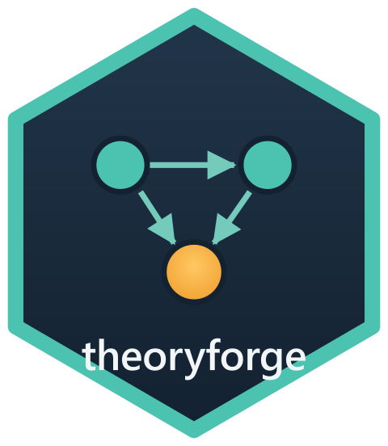

# theoryforge <small>(R)</small> <a href="https://pablobernabeu.github.io/theoryforge/r/"></a>

<!-- badges: start -->
[](https://github.com/pablobernabeu/theoryforge/actions/workflows/ci.yml)
[](https://lifecycle.r-lib.org/articles/stages.html#experimental)
[](https://opensource.org/license/MIT)
<!-- badges: end -->

Systematic theory development: a rigorous, reproducible workflow for building, developing and
testing scientific theories. This is the feature-parity twin of [the Python package](https://pablobernabeu.github.io/theoryforge/python/) of the same
name. The two implementations produce identical verdicts and byte-identical diagram
intermediate representations (see `?theoryforge` for the shared specification behind that
guarantee).

## Interactive web app

Run the package in your browser, with no installation, using the
[interactive web app](https://pablobernabeu.github.io/theoryforge/apps/r/). It executes the real
package client-side via [webR](https://docs.r-wasm.org/webr/latest/), so you can load a theory
and run any operation there, then export the visualisation (SVG/PNG) together with the R code
that reproduces it.

## Installation

The package is not on CRAN yet, so it installs from GitHub, pointing at its subdirectory in the
[monorepo](https://github.com/pablobernabeu/theoryforge) it shares with its Python twin:

```r
# install.packages("remotes")
remotes::install_github("pablobernabeu/theoryforge", subdir = "r/theoryforge")
```

From a local checkout, the package also installs as source:

```r
# from the repository root
install.packages("r/theoryforge", repos = NULL, type = "source")
```

The package depends on `yaml` and `jsonlite`.

## Quick start

```r
library(theoryforge)

# Read a bundled example theory (or build one incrementally with tf_theory + tf_add_*)
theory <- tf_read(system.file("fixtures", "panic-network.theory.yaml",
                              package = "theoryforge"))
tf_validate(theory)

# Score it against the 12-item rigour checklist
report <- tf_check(theory)
report$aggregate_score   # 84.8
report$gate              # "pass"
```

[Get started](https://pablobernabeu.github.io/theoryforge/r/articles/theoryforge.html) walks
through building, checking and diagramming a theory.
[Developing and testing](https://pablobernabeu.github.io/theoryforge/r/articles/developing-and-testing.html)
continues into severity, implied conditional independencies, preregistration, amendment
appraisal and the audit dossier, and
[Mapping the literature](https://pablobernabeu.github.io/theoryforge/r/articles/literature.html)
positions a theory within a bibliometric corpus.

## Public API

The [reference index](https://pablobernabeu.github.io/theoryforge/r/reference/) lists every
exported function, grouped by workflow stage. `tf_render_diagram()` renders any
digraph view in the viewer through DiagrammeR, or as a standalone SVG string
with `as = "svg"`. The rendering packages sit in Suggests rather than Imports, so the
deterministic core carries no dependency on them. For the rationale behind each rigour check and
exactly how every reported value is computed, see
[Methodological foundations](https://pablobernabeu.github.io/theoryforge/r/articles/methodology.html).

## Citation

```r
citation("theoryforge")
```

The [About page](https://pablobernabeu.github.io/theoryforge/r/articles/about.html) carries the
same citation with a BibTeX entry, and a short note on the developer. The repository also ships
`CITATION.cff`, which drives GitHub's 'Cite this repository' button.

## Licence

MIT. See [`LICENSE`](LICENSE).

## Contributing

Issues and pull requests are welcome. The [contributing
guide](https://github.com/pablobernabeu/theoryforge/blob/main/.github/CONTRIBUTING.md)
describes the development setup and the conventions the package follows, and everyone taking
part is asked to honour the [Code of
Conduct](https://github.com/pablobernabeu/theoryforge/blob/main/.github/CODE_OF_CONDUCT.md).

Continuous integration runs `R CMD check --as-cran` on Ubuntu and Windows, against both the
release and the development version of R, alongside the Python suite and the cross-language
parity check, so a change that breaks the twin is caught on the same push.
